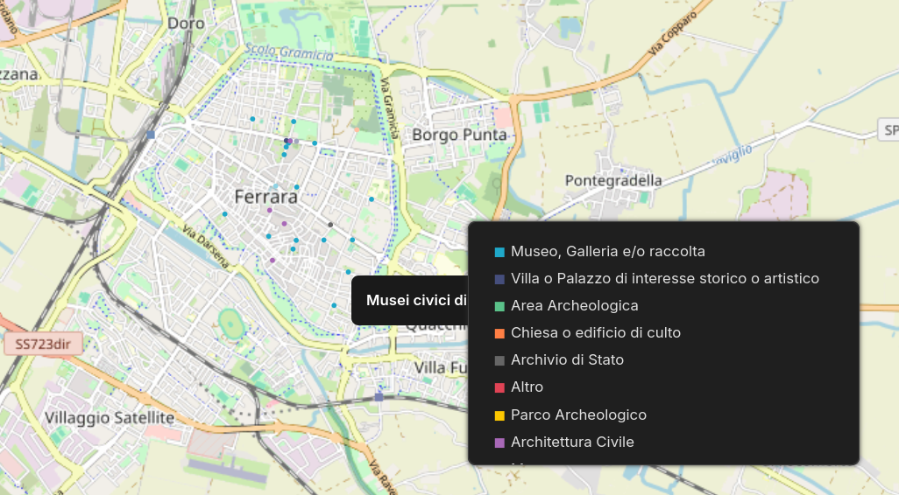

## Cultural Heritage Data Analysis and Enrichment

A **data analysis, data enrichment and data visualization** project based on open datasets related to cultural heritage and cultural activities.

The goal is to build an end-to-end data pipeline starting from raw public data and covering **data quality assessment, cleaning, enrichment, integration, analysis and visualization**, using tools and technologies commonly used by Data Analysts.

---

## Project Goals

The project aims to:

* assess the quality of publicly available cultural datasets;
* identify missing, incomplete or inconsistent data;
* enrich datasets using external sources and Linked Open Data;
* integrate data from different sources;
* use geocoding APIs to enrich geographic information;
* design and query a relational database using **PostgreSQL**;
* perform data analysis using **SQL**;
* create geographic visualizations and interactive dashboards;
* transform raw datasets into meaningful information about the cultural heritage of the territory.

---

## Datasets

The project initially focuses on three datasets:

### Luoghi della Cultura

A dataset containing information about cultural institutions and heritage sites, including:

* identifier;
* name;
* type;
* description;
* address;
* postal code;
* latitude;
* longitude;
* `DBUnico` identifier;
* image.

During the initial data exploration, a **data quality issue** was identified: many records were missing the name and/or address, even though geographic coordinates and a `DBUnico` identifier were available.

### Eventi della Cultura

A dataset containing information about cultural events and activities.

It will be used to analyze the temporal and geographic distribution of cultural events and their relationship with cultural sites.

### Anagrafica di Ferrara

A dataset containing demographic and territorial information about the Ferrara area.

It will be used as an additional source to provide context for the cultural data analysis.

---

## Data Enrichment

To address the missing names in the *Luoghi della Cultura* dataset, the project uses the **Italian Ministry of Culture's Linked Open Data**.

The `DBUnico` identifier is used to query the Ministry of Culture's SPARQL endpoint and retrieve the official name of each cultural site.

### Enrichment Pipeline

```text
Original CSV
     ↓
Python / Pandas
     ↓
Extract DBUnico
     ↓
Ministry of Culture Linked Open Data
     ↓
SPARQL
     ↓
Official cultural site name
     ↓
Enriched CSV
```

The original data are preserved and a new column is added:

```text
nome_mic
```

This makes it possible to clearly distinguish between the original dataset and the data retrieved from the institutional source.

---

## Geocoding

The geographic coordinates are also used to attempt to retrieve address information through **reverse geocoding**.

The process follows this logic:

```text
Latitude + Longitude
        ↓
Reverse Geocoding API
        ↓
Address information
```

Depending on the available geographic data, the following fields may be retrieved:

* address;
* street;
* house number;
* postal code;
* municipality;
* province.

The project also accounts for cases where some information, such as the house number, is not available from the selected geographic source.

---

## Database

The enriched data are imported into **PostgreSQL**.

The database runs through **Docker**, keeping data processing separate from the analysis and visualization stages.

Current enriched table structure:

```text
PostgreSQL
│
└── luoghi_della_cultura_arricchiti
    ├── id
    ├── nome
    ├── tipologia
    ├── descrizione
    ├── indirizzo
    ├── cap
    ├── latitudine
    ├── longitudine
    ├── identificativo
    ├── immagine
    ├── dbunico
    └── nome_mic
```

The next stage will include SQL queries to:

* assess data quality;
* identify missing values;
* analyze cultural site types;
* analyze geographic distribution;
* generate indicators for the final dashboards.

---

## Data Visualization

The project uses **Apache Superset** for interactive data visualization.

The first visualization represents cultural sites geographically using:

* latitude;
* longitude;
* cultural site type;
* official name retrieved from the Ministry of Culture.

### Cultural Heritage Map

*Work in progress — first geographic visualization*



The map will be progressively expanded with additional indicators, filters and analytical dimensions.

---


## Technologies

### Programming & Data Analysis

* Python
* Pandas
* Requests

### Data & APIs

* REST APIs
* Reverse Geocoding
* Linked Open Data
* SPARQL

### Database

* PostgreSQL
* SQL
* Docker

### Data Visualization

* Apache Superset


### Version Control

* Git
* GitHub

---

## Project Status

### Completed

* [x] Initial analysis of the *Luoghi della Cultura* dataset
* [x] Identification of data quality issues
* [x] Extraction of `DBUnico` identifiers
* [x] Connection to the Ministry of Culture's Linked Open Data
* [x] SPARQL queries to retrieve official cultural site names
* [x] Creation of the enriched dataset
* [x] Import into PostgreSQL
* [x] Apache Superset setup
* [x] First geographic visualization of cultural sites

### In Progress

* [ ] Address enrichment through reverse geocoding
* [ ] Handling missing geographic information
* [ ] Assessment of enrichment quality
* [ ] SQL analysis
* [ ] Analysis of the cultural events dataset
* [ ] Integration with Ferrara demographic data
* [ ] Interactive dashboard in Superset


---

## Future Analysis

Once the datasets are fully integrated, the project will explore questions such as:

* Which types of cultural sites are most common?
* How are cultural sites geographically distributed?
* Which municipalities have the highest concentration of cultural sites?
* Which areas are less represented?
* How do cultural events vary over time?
* Which cultural sites host the largest number of events?
* Is there a relationship between population distribution and the presence of cultural sites and events?
* Which fields are most frequently missing from the original datasets?

---

## Project Purpose

This project is a practical case study in **Data Analysis and Data Engineering**, designed to demonstrate a complete and reproducible workflow based on real-world public data.

The focus is not only on the final visualization, but also on the intermediate processes involved in:

**data quality → data enrichment → data integration → database → analysis → visualization**

The project is currently **work in progress**.


